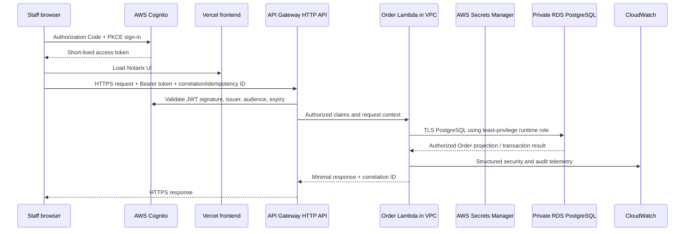

# Notarix Signings Order API/Lambda Vertical-Slice Design — Aug 6 2026

Status: **DESIGNED / PHASE A REPOSITORY IMPLEMENTED / NOT DEPLOYED**

## Executive conclusion

**Decision A: proceed with a separately authorized Order-domain vertical-slice
implementation.** The architecture is technically sound, economically justified,
and appropriate before unrestricted Production launch. It can remove the
PostgreSQL credential and network path from Vercel, place RDS in private subnets,
centralize Order authorization in AWS, and remain below the `$40/month`
low-volume target excluding existing RDS—provided the initial design uses HTTP
API + Lambda, avoids NAT Gateway and RDS Proxy, and controls logs and concurrency.

The representative workflow is:

1. An authenticated staff member retrieves one Order.
2. AWS validates the Cognito access token.
3. Lambda resolves the Cognito subject to a Notarix-owned active user, current
   role assignment, organization relationship, and Order access policy.
4. Lambda reads the Order from private RDS over verified TLS.
5. An Admin or Super Admin places the Order on operational hold through a
   narrowly typed action.
6. Lambda validates the transition and writes the Order status, immutable audit
   event, command receipt, and idempotency result in one transaction.

The design must not copy the current Production fallback behavior. Existing
Order repositories may return seed data after database failure. The AWS service
must fail closed with a correlation ID and sanitized error; synthetic fallback
is Preview/test-only.

One schema prerequisite needs separate migration review: current Order rows use
display strings such as `client`, `clientProfile`, and `notaryProfile`. Reliable
cross-client and assigned-notary authorization requires normalized, immutable
organization/user relationships. The vertical slice should not infer tenancy
from names, email domains, headers, URL parameters, or token-supplied client IDs.

## Scope and success criteria

The slice proves two operations only:

- retrieve one authorized Order projection; and
- place one Order on operational hold.

It succeeds only if authorized staff can read/update the intended Order,
cross-client and cross-role attempts are denied, audit attribution is atomic,
Preview identities cannot call Production, Lambda alone reaches RDS, TLS is
verified, no secret appears in Vercel or responses, and rollback requires no
dual-write or world-open PostgreSQL rule.

Out of scope: notary assignment, document contents, payments, identity evidence,
client/notary mutations, migrations, Production cutover, RDS networking changes,
and all provider configuration.

## Proposed architecture and request flow



Secrets Manager (`S`) supplies the Lambda runtime credential through an approved
AWS mechanism. It is shown logically; the low-cost network method is an explicit
implementation decision described below.

### Responsibility boundaries

| Component | Responsibilities | Must not do |
| --- | --- | --- |
| Browser | Cognito PKCE, memory-only access token, render authorized projection, submit typed action | Assert role, tenant, notary identity, or approval authority |
| Vercel | Host UI/assets, security headers, initiate Cognito flow, render public/non-sensitive shell | Hold `DATABASE_URL`, DB user/password, or connect to RDS |
| Cognito | Authenticate users, MFA/passkeys, Google Workspace staff federation, issue short-lived signed tokens | Be the sole source of mutable Notarix role/tenant authority |
| API Gateway | TLS endpoint, JWT authorizer, exact CORS, throttling, request-size limits, access logs, route to Lambda | Expose PostgreSQL or trust arbitrary identity headers |
| Lambda | Validate input, resolve application identity, enforce RBAC/tenant/Order policy, run business logic, transact, redact errors | Accept client-supplied authoritative role/tenant or return raw rows/errors |
| RDS | Notarix-owned users, roles, Order state, authorization relationships, idempotency, audit evidence | Be publicly reachable in final state |
| CloudWatch | Correlated API/Lambda/security telemetry, alarms, controlled retention | Store tokens, credentials, document contents, or sensitive request bodies |

## Browser-direct versus Vercel proxy

| Concern | Browser calls API Gateway | Vercel proxies API calls |
| --- | --- | --- |
| Identity | API Gateway directly validates Cognito access token | Must securely forward user token or create another trusted actor assertion |
| Token exposure | Access token exists in browser memory; normal OAuth public-client model | Token can remain server-side, but proxy becomes identity/security boundary |
| Database secret | Never in browser/Vercel | Never in Vercel if proxy only calls API |
| Latency/cost | One network hop; one API request | Extra Vercel Function hop and compute/log cost |
| CORS | Exact-origin policy required | Same-origin browser request is simpler |
| CSRF | Bearer header, not cookie; lower CSRF exposure | Cookie-authenticated proxy requires CSRF controls |
| XSS | In-memory bearer token can be stolen by successful XSS | HttpOnly cookie reduces token theft, but proxy/session remains target |
| Audit | Cognito subject reaches AWS directly | Requires reliable end-user propagation through proxy |
| Maintainability | Clear AWS identity/data boundary | More glue, token forwarding, and failure modes |

**Recommendation:** use browser-direct API Gateway calls for authenticated Order
operations. Use Authorization Code + PKCE; hold access tokens in memory, never
local/session storage; use a short token lifetime and refresh through an
approved session design. Exact CORS permits only `https://notarix.live` and the
approved `www` behavior; Preview uses a separate API/client or no Production
origin. Keep the CSP restrictive and avoid rendering untrusted HTML.

Vercel OIDC is still useful for non-user server operations and deployment
automation, but it is not the actor identity for this interactive slice. If SSR
of protected Order content is later mandatory, design a narrowly scoped BFF
that forwards the original Cognito token; do not mint an unverified role header.

## Authentication, identity, and authorization model

### Authentication

1. Cognito uses Authorization Code + PKCE. Staff choose Google Workspace SAML;
   client/notary users use approved Cognito-native or federated flows.
2. Cognito enforces MFA and offers phishing-resistant passkeys where supported.
   Staff domain restrictions apply during federation/provisioning, not merely in
   the UI.
3. API Gateway JWT authorizer validates signature, `iss`, Production app-client
   audience, token use, and expiration. Preview uses distinct app/API clients.
4. Lambda accepts only the authorizer's verified subject and token metadata.
   Email and Cognito groups are hints, never final application authority.

### Application-owned authority

Lambda resolves `(issuer, sub)` through `portal_user_identities`, then requires:

- `portal_users.status = ACTIVE`;
- an unrevoked `portal_role_assignments` row;
- an unrevoked organization membership for client users;
- an active notary profile/assignment for notaries; and
- Order-specific policy satisfaction.

For the staff-only slice:

- read: `GEN_ADMIN`, `ADMIN`, or `SUPER_ADMIN`, plus Order-scope policy;
- place operational hold: `ADMIN` or `SUPER_ADMIN` only;
- role elevation: separate elevated approval writes a new attributable role
  assignment; token claims alone cannot elevate;
- Super Admin owner locks remain enforced in application data;
- suspended/disabled users and revoked roles are denied immediately on the next
  API request regardless of unexpired token.

Session lifetime and revocation require short access tokens plus database status
checks on every sensitive operation. Cognito global sign-out/token revocation
handles provider sessions; Notarix session/role revocation remains authoritative
for application access.

### Tenant and Order policy

The current schema lacks a normalized tenant relationship. A later approved
migration should add or establish equivalents of:

- `organizations(id, profile_number, type, status)`;
- `organization_memberships(user_id, organization_id, status, role)`;
- `orders.client_organization_id` (or normalized companion table);
- `order_notary_assignments(order_id, notary_user_id/profile_id, status)`; and
- immutable Order audit/idempotency records if command-center tables cannot meet
  the final constraints.

Policy:

- staff: role permits the operation and any jurisdiction/queue restriction;
- client: active membership in the exact Order owner organization;
- notary: active assignment to the exact Order and action is assignment-safe;
- observer: no Order access unless an explicit scoped grant exists;
- denied and not-found results both return `404` when revealing existence would
  leak tenant information; security logs retain the internal reason.

## AWS private network design

### Target topology

- Use the existing VPC only after creating dedicated application and database
  private subnets across at least two AZs; do not reuse the current six default
  public subnets as the final RDS subnet group.
- RDS subnet route tables have no Internet Gateway or NAT default route.
- Lambda uses private application subnets in at least two AZs and a dedicated
  `notarix-prod-order-lambda-sg`.
- RDS uses a dedicated `notarix-prod-rds-sg` and private DB subnet group.
- API Gateway HTTP API is a public regional HTTPS service and invokes Lambda via
  the AWS service integration; it does not need network ingress into the VPC.
- Lambda does not require inbound rules. RDS accepts only Lambda, migration, and
  named administration SG sources.

Target SG relationships:

| Security group | Direction | Protocol/port | Peer |
| --- | --- | --- | --- |
| Order Lambda SG | Egress | TCP 5432 | RDS SG only |
| RDS SG | Ingress | TCP 5432 | Order Lambda SG |
| RDS SG | Ingress | TCP 5432 | Separate approved migration-runner SG |
| RDS SG | Ingress | TCP 5432 | Separate named admin/SSM path SG |
| RDS SG | Ingress | Any | No `0.0.0.0/0`, no `::/0`, no Vercel source |

The Lambda SG may need HTTPS 443 egress to a specific Secrets Manager interface
endpoint SG if runtime secret retrieval is chosen. It receives no general
Internet egress.

### Internet, NAT, and endpoints

- Internet Gateway: may remain attached for unrelated public resources, but no
  RDS route or public RDS address uses it.
- NAT Gateway: **not proposed**. API Gateway invocation and CloudWatch Lambda log
  delivery do not require Lambda Internet access. Avoiding NAT preserves the
  low-cost case.
- Secrets: preferred low-cost proof is an approved Secrets Manager secret plus
  one of two reviewed mechanisms: (A) retrieve through a Secrets Manager
  interface endpoint in two AZs (about `$14.60/month` fixed), or (B) use a
  deployment-time AWS-native secret injection mechanism that never exposes the
  plaintext outside the Lambda environment and supports rotation. Option B must
  be proven operationally; do not copy the secret into source/IaC state.
- S3: a gateway endpoint has no hourly endpoint charge when the Lambda later
  needs private S3 access.
- Additional interface endpoints (SES/SNS/STS) are not part of this slice. Split
  functions by network need or add only measured endpoints; do not create NAT by
  default.

RDS can and ultimately must become `PubliclyAccessible=false`. That is a final
multi-module cutover, not an Order-slice prerequisite.

## Database access model

Lambda alone receives a least-privilege `notarix_prod_order_app` credential. It
has `CONNECT` to the Production database, `USAGE` on the approved schema, and
only the exact `SELECT`, `UPDATE`, `INSERT` privileges required for Order,
identity lookup, audit, and idempotency tables. It has no schema `CREATE`, role,
database, extension, migration, ownership, or unrelated-domain privileges.

Use verified TLS with hostname validation and the current AWS RDS CA bundle.
Connection and statement timeouts are short. Set `application_name` to the
versioned Order Lambda identity for logs. Never log the URL or password.

Migration and administrative roles remain separate, non-runtime credentials and
separate SG paths. Vercel has no database environment variables or network path.

### RDS Proxy decision

Do not add RDS Proxy initially. The slice has two operations, controlled Lambda
reserved concurrency, and low traffic. Use direct connections with a small
per-execution-environment pool (`max=1`), connection reuse, and a reserved
concurrency ceiling derived from RDS connection capacity. Load test cold/warm
behavior. Add Proxy only if measured concurrent connections, failover recovery,
or IAM database authentication benefits justify its vCPU-linked fixed cost.

## Order API contract

Version prefix: `/v1`. Media type: JSON. Maximum request/response sizes are
narrow. IDs use the existing `ORD-STATE-YYMM-SEQUENCE` policy. Internal table
names and unrestricted row objects are never exposed.

### Retrieve authorized Order

`GET /v1/orders/{orderId}`

- Authentication: Cognito Production access token; API Gateway JWT authorizer.
- Roles: active `GEN_ADMIN`, `ADMIN`, or `SUPER_ADMIN` for this slice.
- Input: path `orderId` matching `^ORD-[A-Z]{2}-\d{4}-\d{4}$`; optional
  `If-None-Match`; no client/role query parameters.
- Authorization: resolve application user/role; load Order by ID; enforce staff
  Order scope. Later client/notary callers use normalized relationship policy.
- Output `200`:

  ```json
  {
    "order": {
      "id": "ORD-NC-2607-0001",
      "status": "Assignment Queued",
      "serviceType": "Traditional Notarization",
      "jurisdiction": "NC",
      "appointmentAtUtc": "2026-08-07T22:00:00Z",
      "assignmentStatus": "Pending",
      "documentReadiness": "Restricted",
      "risk": "Standard",
      "nextAction": "Complete assignment review",
      "version": 7,
      "updatedAtUtc": "2026-08-06T20:00:00Z"
    },
    "correlationId": "..."
  }
  ```

- Excluded: signer PII, exact address, emails, document keys/URLs, financial
  data, internal owner notes, provider receipts, and unrelated tenant data.
- Audit: structured read-access event (actor user ID, role assignment ID, Order
  ID, policy decision, correlation ID, timestamp); do not duplicate PII.
- Responses: `200`, `304`, `400` malformed ID, `401` invalid/expired token,
  `403` authenticated but role categorically prohibited where safe, `404`
  absent/out-of-scope Order, `429`, `500` correlation-only, `503` dependency
  unavailable, `504` timeout.

### Place Order on operational hold

`POST /v1/orders/{orderId}/actions/place-hold`

- Authentication: Cognito Production access token.
- Roles: active `ADMIN` or `SUPER_ADMIN`; no browser-supplied elevation.
- Headers: required `Idempotency-Key` UUID (scoped to actor + route + Order),
  `If-Match: "<version>"`, optional valid `X-Correlation-Id` or server-generated.
- Input:

  ```json
  {
    "reasonCode": "DOCUMENT_REVIEW",
    "note": "Validated documents require administrator review."
  }
  ```

- Validation: strict object/no extra fields; approved reason enum; trimmed note
  1–500 characters; no HTML; Order ID format; payload/body limit; optimistic
  version match; transition policy disallows closed/cancelled/immutable states.
- Authorization: same identity/Order checks plus Admin/Super Admin authority.
- Transaction: lock/version-check Order; insert idempotency record; update status
  to canonical `OPERATIONAL_HOLD`; insert immutable command event/receipt and
  audit decision; commit once. Store payload hash and prior response for safe
  replay. No notification/provider side effect in this slice.
- Output `200`: Order ID, previous/new status, version, audit receipt ID,
  occurred-at UTC, correlation ID. No raw row.
- Audit: actor user and identity subject, effective role-assignment ID, action,
  Order, prior/new status, reason code, authorization decision, idempotency key
  fingerprint, correlation/request IDs, UTC timestamp. Audit text is derived
  server-side, not accepted from the client.
- Responses: `200` success or identical replay, `400` validation,
  `401`, `403`, `404`, `409` invalid transition/version or same key with changed
  payload, `422` policy condition, `429`, `500`, `503`, `504`.

## Reliability, errors, abuse, and logging

- API Gateway throttles per route and account; initial conservative limits are
  finalized through load tests. WAF is optional and cost-gated, not assumed.
- Lambda reserved concurrency protects RDS. Do not automatically retry client
  mutations at the platform layer. GET may retry once for a transient connection
  failure with bounded jitter if the total deadline permits.
- Client mutation retries require the same idempotency key. Lambda timeout must
  be shorter than API Gateway's deadline; database timeouts shorter still.
- Every layer propagates a UUID correlation ID. Reject oversized/invalid IDs and
  never use them as authorization evidence.
- API access logs include route, status, latency, Cognito subject hash, request
  and correlation IDs; Lambda logs structured outcomes and SQLSTATE class only.
  RDS logs connection username/database/source/application name. No token, SQL
  text, secret, note body, PII, or stack trace enters ordinary logs.
- External errors use stable codes such as `ORDER_NOT_FOUND`,
  `ORDER_ACTION_FORBIDDEN`, `VERSION_CONFLICT`, and `SERVICE_UNAVAILABLE` plus
  correlation ID. Stack traces remain restricted to AWS logs.
- Alarm on authorization-denial bursts, invalid tokens, throttles, Lambda
  errors/timeouts, high duration/concurrency, RDS connection exhaustion,
  authentication failures, and audit transaction failure.

## Shared business logic strategy

Create workspace packages only during implementation:

- `packages/order-contracts`: dependency-light TypeScript request/response
  types, strict schemas, status/action enums, error codes, and formatters;
- `packages/order-domain`: transition rules and pure authorization predicates
  that consume server-resolved facts, never request headers;
- `services/order-api`: Lambda handlers, identity/authorization orchestration,
  repositories, transactions, telemetry, and AWS adapters;
- `app/order-api-client.ts`: Vercel/browser transport only.

Drizzle schema/query ownership moves to the AWS service database adapter. Shared
packages must not import Next.js, AWS SDK, Drizzle clients, environment variables,
or secrets. Tests reuse contracts/domain functions. The UI may predict button
visibility for usability, but only Lambda makes authorization decisions.

## Existing Order persistence inventory and refactor map

### Direct Order database call sites

| File | Lines/symbols | Current database operations | Future location |
| --- | --- | --- | --- |
| `app/order-repository.ts` | `listOrderOperations`, `getOrderOperation` | Select operational Orders | Lambda Order repository; Vercel wrapper becomes API client |
| `app/order-repository.ts` | `listOrderLifecycle` | Select lifecycle by Order | Later Order API projection |
| `app/order-repository.ts` | `listOrderCloseoutControls` | Select closeout rows | Later domain endpoint |
| `app/order-repository.ts` | `listOrderDeliveryReceipts` | Select delivery receipts | Later client-safe endpoint |
| `app/order-repository.ts` | `listNotaryCompletionReceipts` | Select notary receipts | Later assigned-notary/staff endpoint |
| `app/order-repository.ts` | `listAppointmentConfirmations` | Select appointments | Later appointment endpoint |
| `app/order-repository.ts` | `listSignerReadiness`, `listOrderSigners` | Select signer readiness | Later restricted signer endpoint |
| `app/order-repository.ts` | `persistOrderCommandTransition` | Upsert Order status | Replaced by atomic Lambda action transaction |
| `app/staff/command-center/store.ts` | `listPersistedCommandCenterReceipts`, `getPersistedCommandCenterReceipt` | Select target/event/receipt | Lambda audit/command repository |
| `app/staff/command-center/store.ts` | `persistCommandCenterReceipt` | Upsert target/event/receipt | Lambda transaction with Order mutation |

There are ten `getOptionalDb()` sites in `app/order-repository.ts` and three in
`app/staff/command-center/store.ts`. The command action currently writes command
audit and Order status through separate calls; the slice must make them one
transaction.

### File-by-file map

| Existing file | Current responsibility | Proposed responsibility | Placement/lifecycle | Tests |
| --- | --- | --- | --- | --- |
| `db/index.ts` | Vercel Postgres connection | Retained temporarily for unmigrated domains; not imported by Order UI after cutover | Vercel until final module migration; delete Production runtime use last | DB target/fail-closed tests |
| `db/schema.ts` | All Drizzle tables | Split/re-export shared schema metadata; Order tables owned by service adapter | Shared/service; migration tooling separate | Schema/migration contract |
| `app/order-repository.ts` | DB queries plus seed fallback | Compatibility façade calling typed Order API; no Production fallback | Vercel during migration; remove/rename after consumers migrate | Client contract/error tests |
| `app/staff/command-center/store.ts` | In-memory rules, DB audit, Order mutation | Pure command definitions may move shared; Order action calls API; other domains remain temporarily | Split shared/Vercel/Lambda; delete DB portions only after migration | Authority, transition, audit atomicity |
| `app/staff/command-center/route.ts` | Staff command endpoint | Route Order action through Order API; keep other actions temporarily | Vercel BFF or replace Order form with direct API client | Auth, CSRF if retained, routing |
| `app/orders/[orderId]/page.tsx` | Broad Order dossier | Render approved API projection; fetch protected fields separately | Vercel; likely client/server boundary adjustment | Projection and denial UI |
| `app/staff/orders/page.tsx` | Staff Order list | Later list endpoint; not in first two-operation slice | Vercel | List policy/pagination later |
| `app/staff/orders/[orderId]/assignment/page.tsx` | Assignment view | Use typed Order read; actions remain outside slice | Vercel | Staff scope |
| `app/staff/order-closeout/page.tsx` | Closeout reads | Later API endpoint | Vercel | Closeout policy |
| `app/client/orders/page.tsx` | Filters all Orders client-side | Must become tenant-filtered API query; never load all Orders | Vercel; migrate before client Production | Cross-client denial |
| `app/client/orders/[orderId]/completion/page.tsx` | Client Order/receipt view | Client-safe projection endpoint | Vercel | Tenant and field filtering |
| `app/notary/assignments/[orderId]/completion/page.tsx` | Notary Order/doc view | Assignment-scoped projection endpoint | Vercel | Cross-notary denial |
| `app/client/order-actions/route.ts` | Uses hard-coded actor and role | Replace with verified Cognito identity/API action | Delete after migrated client actions | Identity spoofing denial |
| `app/notary/assignment-actions/route.ts` | Uses hard-coded actor and role | Replace with assigned-notary API action | Delete after migrated notary actions | Assignment denial |
| `app/access-policy.ts` | Vercel route RBAC | UI/navigation gate only; canonical policy moves shared/Lambda | Vercel + shared mapping | Claim-vs-DB-role tests |
| `app/cognito-jwt.ts` | Cognito JWT validation in Next | API Gateway validates; Lambda defensively checks context | Retain for Vercel session paths; AWS has separate adapter | Issuer/audience/expiry |
| `app/cognito-session.ts` | DB-backed opaque Vercel session | Must migrate behind identity API before removing Vercel DB access | Temporary Vercel dependency | Revocation/session tests |
| `app/portal-user-repository.ts` | Identity/session direct DB | Move to AWS identity service/repository | Lambda in later slice | Cross-client/role/session |
| `tests/source-contract.test.mjs` | Hosting/database contracts | Assert Order frontend imports no DB and Vercel has no DB secret at end | Repository CI | Reference controls |

The identity/session repository is a critical non-Order dependency: Vercel
cannot lose `DATABASE_URL` until it too moves behind AWS or the browser-direct
Cognito/application-identity pattern replaces its database session dependency.

## Incremental migration sequence

No big bang and no dual-write are required.

1. Approve contracts, normalized authorization schema, threat model, cost ceiling,
   and Preview-only infrastructure plan.
2. Create shared pure contracts/domain logic and exhaustive unit tests.
3. Provision isolated Preview API/Lambda/private networking/secret and connect
   only to the isolated Preview database after separate authorization.
4. Implement GET with synthetic data; compare its projection against the current
   repository in tests. A temporary dual-read may run in Preview or shadow mode,
   but the response uses one authoritative source and no Production data.
5. Implement place-hold with transaction/idempotency/audit tests. Do not dual-write.
6. Route only the selected Preview Order read/action to AWS behind a server-owned
   feature flag. Exercise cross-role/client/notary/environment denial.
7. Complete load, timeout, RDS connection, audit, secret, logging, and rollback
   evidence. Owner approves Production infrastructure separately.
8. In Production, deploy API path dark, validate readiness, then switch the two
   operations to AWS. Their writes have exactly one owner: Lambda.
9. Observe and roll additional Order operations, then other persistence modules,
   one bounded domain at a time.
10. Migrate identity/session persistence, remove all Vercel Production DB calls,
    delete Vercel Production DB variables, prove denial, then make RDS non-public.

## Test plan

| Area | Required evidence |
| --- | --- |
| Authentication | Valid Production token passes; invalid signature, issuer, audience/client, token use, expired/revoked token fail |
| Roles | GenAdmin reads but cannot hold; Admin/Super Admin hold; missing/revoked/elevated-only claim denied |
| Tenancy | Cross-client, cross-notary, unassigned notary, observer, and Preview client denied; browser-supplied tenant/role ignored |
| Read | Valid projection exact; unauthorized/absent Order enumeration-safe; no excluded fields |
| Mutation | Valid transition, invalid enum/note/ID, stale version, prohibited state, missing Order, correct UTC/version |
| Audit | Allowed and denied attempts attributable; Order/audit/idempotency atomic; rollback leaves none partially written |
| Idempotency | Same key/payload returns same result; changed payload conflicts; concurrent duplicates produce one mutation |
| Failures | RDS unavailable/auth/TLS failure, deadlock/transient SQLSTATE, Lambda/API timeout, throttle, malformed response |
| Retry | GET bounded retry only; mutation platform retry disabled; client retry uses identical key |
| Leakage | No secret/token/URL/stack/SQL/customer data in response, logs, build, IaC output, or Vercel variables |
| Network | RDS accepts Lambda SG; denies Vercel, Preview, Internet, unrelated Lambda/SG, `0.0.0.0/0`, and `::/0` |
| Performance | Cold/warm latency, 100k/5m model, reserved concurrency, DB connection ceiling, failover behavior |
| Recovery | Feature-flag rollback, last-known-good Lambda, API stage rollback, database restore/audit continuity |

The restricted database-backed readiness check remains mandatory and should
report environment/resource/role fingerprints, TLS, harmless query success,
Lambda deployment ID, and correlation timestamp without secrets or customer data.

## Cost ceiling

Low-volume estimate excludes existing RDS and tax:

| Component | Fixed | Very low usage | Moderate usage | Status |
| --- | ---: | ---: | ---: | --- |
| Vercel Pro | `$20/month` | Included credit model | Usage above credit varies | Required for commercial frontend |
| API Gateway HTTP API | `$0` fixed | About `$0.10` at 100k | About `$5` at 5m | Usage-based; published first tier about `$1/million` |
| Lambda | `$0` fixed | Usually within free tier | Roughly `$1–$8` depending duration/memory | Usage-based |
| CloudWatch | `$0` fixed | `$1–$3` | `$3–$10` | Estimate; control volume/retention |
| Secrets Manager | `$0.40/secret/month` | Near-zero calls | Low call cost | Required approved secret home |
| Secrets Manager interface endpoint | About `$14.60/month` for two AZ ENIs | Minimal data | Data processing extra | Recommended if runtime retrieval needs it; largest fixed AWS item |
| Data transfer | `$0` fixed | `<$1` estimate | `$2–$8` estimate | Payload/route dependent |
| Private RDS subnets/SG/route tables | `$0` | `$0` | `$0` | No NAT/public IPv4 proposed |
| NAT Gateway | `$0` | `$0` | `$0` | Explicitly excluded |
| RDS Proxy | `$0` | `$0` | `$0` | Deferred optional future cost |

Expected total with two-AZ Secrets Manager endpoint: approximately **$36–$39
per month at very low volume**, including Vercel Pro. Without the endpoint, an
approved AWS-native injection method could reduce this to about **$21–$25**, but
must not weaken rotation or leak plaintext. Moderate traffic is approximately
`$45–$70` depending compute, logs, and transfer; this exceeds `$40` because of
usage, not an unnecessary always-on network component.

Do not add NAT Gateway: its hourly baseline would materially break the low-cost
objective. Do not add WAF, RDS Proxy, additional interface endpoints, or
always-on compute without measured need and a new cost gate.

Pricing references: [API Gateway](https://aws.amazon.com/api-gateway/pricing/),
[Lambda](https://aws.amazon.com/lambda/pricing/),
[Secrets Manager](https://aws.amazon.com/secrets-manager/pricing/),
[PrivateLink](https://aws.amazon.com/privatelink/pricing/), and
[Vercel OIDC availability](https://vercel.com/docs/oidc/reference).

## Engineering effort and phases

| Workstream | Size | Sequencing estimate |
| --- | --- | --- |
| Order contracts/pure domain rules | Medium | 1–2 focused work sessions |
| Normalized tenant/assignment/audit schema design | Medium | 1–2 design/review sessions; migration separately gated |
| AWS IaC/network/API/Lambda/secret/logging | Medium | 2–4 implementation/rehearsal sessions |
| GET and place-hold service | Medium | 2–4 implementation sessions |
| Vercel Order client/UI cutover | Medium | 2–3 sessions |
| Security/integration/load/rollback evidence | Large | 3–5 focused test sessions |
| SOP/runbooks/evidence | Medium | 1–2 sessions |
| Complete seven-module persistence migration | Large | 5–8 domain phases after the slice, each independently gated |

These are sequencing units, not calendar commitments. Identity/session migration,
schema normalization, and Production private-RDS cutover are separate phases.

## Rollback design

1. Before cutover, capture current deployment, API/Lambda versions, feature flag,
   schema version, and health evidence.
2. The selected mutation has one writer at a time. Before flag switch, Vercel is
   writer; after switch, Lambda is writer. Never dual-write.
3. Rollback stops new mutations briefly, drains in-flight requests, verifies
   idempotency/audit completion, then points the workflow to the last known-good
   implementation. Reads can switch independently.
4. Lambda commits Order update, audit event, receipt, and idempotency result in
   one transaction. A failure rolls all of them back.
5. Keep API records and audit history; never delete evidence to roll back.
6. Keep the current RDS network path only during the broader controlled migration.
   Rollback uses that already-approved path; it does not add `0.0.0.0/0`.
7. Once all Vercel DB dependencies are gone and RDS is private, rollback is to a
   previous AWS service version—not direct Vercel PostgreSQL or public RDS.

## Final RDS network end state

- `PubliclyAccessible=false`.
- Dedicated private database subnets in at least two AZs, without IGW/NAT route.
- No `0.0.0.0/0`, no `::/0`, and no Vercel ingress.
- PostgreSQL ingress only from versioned AWS application SGs, a separately
  controlled migration runner, and named MFA-backed SSM administrative path.
- Preview has separate account/resource/network/credentials and no route or SG
  permission to Production.
- Vercel has no `DATABASE_URL`, migration URL, DB identity, or network access.
- TLS verification, least-privilege roles, connection/disconnection logs,
  database/user/source/application attribution, CloudWatch export, initial
  30-day retention, authentication alarms, backups, and restore drills.
- `174.106.104.109/32` remains **UNVERIFIED** now and is removed in the final
  approved cutover unless ownership and necessity are proven.

## Impact on remaining Notarix capabilities

| Capability | Effect |
| --- | --- |
| Cognito / Google Workspace | Easier central JWT enforcement and staff federation; requires final claims-to-Notarix-identity mapping and separate Production/Preview clients |
| S3 / document evidence | Easier IAM-private integration and S3 gateway endpoint; signed URL, malware, custody, and field filtering remain separate high-risk design |
| SES / SMS/SNS | Easier IAM attribution and asynchronous dispatch; VPC interface access or non-VPC worker split must avoid NAT and duplicate sends |
| Identity verification | Provider callbacks can terminate at authenticated API routes; sensitive result storage/review remains separately scoped |
| Payments | Stronger service boundary and audit/idempotency; requires dedicated payment domain, webhook signatures, ledger controls, and no card/bank data in Order API |
| RON | Central policy can enforce jurisdiction/service/notary eligibility; provider/video/evidence controls remain specialized |
| Audit logging | Materially improved through actor, decision, request, transaction, and AWS service correlation |
| Backups / disaster recovery | Private RDS does not change automated backups; API/Lambda IaC, multi-AZ subnet design, restore rehearsal, secret recovery, and regional recovery runbooks expand DR scope |

The architecture makes AWS-native integrations easier through IAM and common
telemetry. It makes frontend development slightly more complex because browser
API contracts, CORS, token lifecycle, and explicit failure states replace direct
server repository calls.

## Principal risks

1. Identity/session persistence still directly uses RDS from Vercel; it must be
   migrated before removing the final Vercel database credential.
2. Current Order tenant/notary relationships are denormalized and cannot support
   robust cross-client authorization without schema work.
3. Public API abuse shifts the attack surface from PostgreSQL to HTTPS; strict
   JWT, validation, throttling, logging, and narrow operations are mandatory.
4. Browser bearer tokens increase XSS consequences; CSP, memory-only storage,
   short lifetimes, dependency controls, and no unsafe rendering are required.
5. Lambda connection storms can exhaust a small RDS instance; reserved
   concurrency and load evidence precede Proxy decisions.
6. Secrets Manager private access can consume about `$14.60/month`; adding many
   interface endpoints or NAT would erase the cost advantage.
7. Partial domain migration can confuse ownership; feature flags and a written
   operation-to-writer register are required.
8. Existing seed fallback masks Production database failures; AWS and migrated
   Vercel paths must fail closed.

## Owner decisions required

1. Approve Decision A and authorize implementation only after a reviewed threat
   model, schema prerequisite, IaC plan, and cost ceiling.
2. Approve browser-direct Cognito access-token calls or require a BFF redesign.
3. Approve `ADMIN`/`SUPER_ADMIN` as the operational-hold authority and the exact
   canonical transition/reason codes.
4. Approve normalized organization membership and Order ownership as a migration
   prerequisite; migration execution remains separate.
5. Choose Secrets Manager access: two-AZ interface endpoint (estimated
   `$14.60/month`) or a proven lower-cost AWS-native injection mechanism.
6. Approve initial Lambda reserved concurrency after the RDS connection budget
   is measured; keep RDS Proxy deferred.
7. Approve exact CORS origins, token/session lifetimes, log retention, alarms,
   and low-volume cost alert threshold.
8. Confirm the Order slice will be tested only against isolated Preview with
   synthetic data before any Production resource is created.

## Exact next action

Phase A is complete. Owner reviews the Phase A evidence, proposed normalized
authorization migration, and non-deployable resource manifest. If accepted,
separately authorize implementation only against isolated Preview AWS
infrastructure with synthetic data. That authorization must select the IaC
framework, secret-delivery option, exact cost ceiling, and migration rehearsal;
none is implied by Phase A.

No purchase, infrastructure, database, environment, deployment, Cognito, Google
Workspace, Preview runtime, or Production change was performed. Phase A changed
repository contracts, pure rules, tests, documentation, and a narrowly scoped
Production fail-closed safeguard only; it was not deployed.
